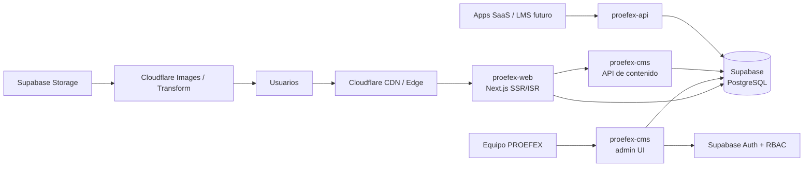

# Documento 01 — Arquitectura Técnica General

**Fase:** 0 — Definición
**Estado:** Propuesta para revisión
**Dominio principal:** proefexperu.com

---

## 1. Resumen

Plataforma digital escalable para PROEFEX compuesta por cuatro aplicaciones independientes, un stack unificado en TypeScript y Supabase como núcleo de datos, autenticación y almacenamiento. La experiencia visual (motion, composiciones, universos TECH / Grow Up) se soporta sobre un frontend Next.js renderizado en el servidor con generación incremental (ISR), de modo que el contenido se administra desde el CMS sin reconstruir la plataforma.

## 2. Principios de arquitectura

1. **Separación de responsabilidades:** contenido (CMS), experiencia (web), lógica de negocio (API) e infraestructura (IaC) viven en repositorios y despliegues independientes.
2. **Contenido estructurado, no page builder libre:** el CMS administra bloques tipados con esquemas validados; el frontend decide cómo renderizarlos.
3. **Performance como restricción de diseño:** toda decisión visual debe validar presupuestos de Core Web Vitals antes de aprobarse.
4. **Preparado para evolución:** LMS, productos SaaS e integraciones se contemplan como puntos de extensión (subdominios, APIs, webhooks), no como código actual.
5. **Un solo lenguaje de stack:** TypeScript de extremo a extremo para reducir fricción entre equipos.

## 3. Stack tecnológico

| Capa | Tecnología | Justificación |
|---|---|---|
| Frontend | Next.js (App Router) + React + TypeScript | SSR/ISR, streaming, metadata API, Server Components, ecosistema maduro |
| Estilos | Tailwind CSS + design tokens propios | Escala con tres universos visuales (Core / TECH / Grow Up) |
| Animación | Motion (Framer Motion) + GSAP puntual + Lottie | Declarativo para UI, GSAP para secuencias complejas, Lottie para assets de diseño |
| CMS | Aplicación admin independiente (Next.js) sobre Supabase | Ver sección 6 y Documento 06 |
| API | Capa independiente (Next.js Route Handlers / servicio Node + Hono o similar) | Lógica de negocio, integraciones, futuros webhooks |
| Base de datos | Supabase / PostgreSQL | Relacional, RLS, tiempo real si se requiere |
| Auth (CMS) | Supabase Auth | Sesiones, MFA, integración nativa con RLS |
| Storage | Supabase Storage + Cloudflare (CDN/transformación) para imágenes, SVG y documentos generales | Video: arquitectura diferenciada; proveedor especializado (ej. Cloudflare Stream) se evalúa en D5 — **DEFERRED** hasta inventario audiovisual |
| Funciones backend | Supabase Edge Functions y/o API propia | Webhooks de CMS, validaciones, automatizaciones futuras |
| Hosting | Cloudflare (Pages/Workers) para web y admin | CDN global, transforms, rate limiting en el edge |
| IaC / config | `proefex-infrastructure` (DNS, Workers, CI/CD, entornos) | Un lugar para la configuración del ecosistema |

## 4. Repositorios (sin monorepo)

| Repositorio | Contenido | Despliegue |
|---|---|---|
| `proefex-web` | Frontend público Next.js. Design system, bloques, páginas, SEO | `www.proefexperu.com` (Cloudflare Pages) |
| `proefex-cms` | Aplicación de administración de contenidos (panel + esquemas de bloques) | `admin.proefexperu.com` (Cloudflare Pages + Workers) |
| `proefex-api` | API de lógica de negocio, integraciones, endpoints públicos/privados | `api.proefexperu.com` (Cloudflare Workers) |
| `proefex-infrastructure` | DNS, entornos, secretos (referencias), CI/CD compartido, IaC | — |

**Decisión contra monorepo:** cuatro dominios de despliegue distintos, equipos y ciclos de release diferentes; no existe hoy razón técnica que compense el costo de acoplamiento. Se reevaluará si el design system necesita compartirse con más apps (en ese caso, paquete privado publicado).

## 5. Diagrama de alto nivel

## 6. Estrategia de renderizado

| Tipo de página | Estrategia | Revalidación |
|---|---|---|
| Home y landings de línea | SSR + ISR | Webhook del CMS al publicar |
| Páginas de servicios / sectores / productos | ISR estático | Webhook + revalidación por tag |
| Blog / casos | ISR | On-demand por publicación |
| Páginas legales / institucionales | Estático | On-demand |
| Formularios / contacto | Server Actions o API | Tiempo real |

El contenido vive en PostgreSQL; el frontend consulta la API de contenido del CMS (lectura pública con caché) y se regenera bajo demanda. No hay cliente que espere al CMS para pintar el HTML inicial.

## 7. Entornos

| Entorno | Web | CMS | API | Base de datos |
|---|---|---|---|---|
| Producción | www.proefexperu.com | admin.proefexperu.com | api.proefexperu.com | Supabase proyecto prod |
| Staging | staging.proefexperu.com | admin-staging.proefexperu.com | api-staging.proefexperu.com | Supabase proyecto staging |

Reglas: separación estricta de secretos por entorno; backups automáticos diarios en prod (Supabase PITR); migraciones de esquema versionadas en Git; staging es el único punto de prueba de migraciones.

## 8. Puntos de extensión diseñados desde hoy

1. **LMS (futuro):** `learn.proefexperu.com` como app propia; la web lo enlaza y consume su catálogo vía API cuando exista. El modelo de contenidos ya contempla entidades `Course` (Documento 05) en estado `planned`.
2. **Productos SaaS:** cada producto (Turu CRM, PROEFACT, My Bpass, AtendiGo, Eleventto, Klyra) puede tener landing propia gestionada por CMS, dominio propio futuro, y consumo de `proefex-api` para formularios/leads.
3. **Automatización:** la API expone webhooks y eventos (ej. nuevo lead → CRM/CRM propio) sin acoplar el frontend.
4. **i18n:** la arquitectura de URLs y el modelo de contenidos soportan futura localización (decisión pendiente, Documento 19).

## 9. Decisiones abiertas de esta arquitectura

- Motor del CMS: custom sobre Supabase (recomendado) vs. headless comercial (Strapi, Payload, Sanity). Ver Documento 06 y Documento 19.
- Capa API: Workers puros vs. servicio Node desplegado. Ver Documento 07.
- Localización multi-idioma inicial. Ver Documento 19.
