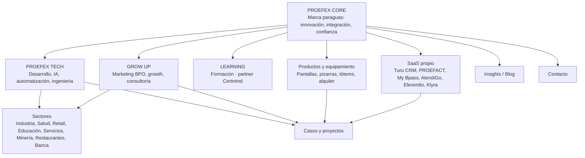

# Documento 02 — Arquitectura de Información

**Fase:** 0 — Definición
**Estado:** Propuesta para revisión

---

## 1. Modelo mental del ecosistema

PROEFEX digitalmente es **un ecosistema de capacidades empresariales**, no una consultora con una lista de servicios. La arquitectura de información debe responder tres preguntas en el primer scroll:

1. ¿Qué hace PROEFEX? → **PROEFEX CORE** (marca paraguas)
2. ¿Cómo lo hace? → **PROEFEX TECH** (tecnología + ingeniería) y **GROW UP** (marketing y crecimiento)
3. ¿Qué entrega? → **Productos** (equipamiento), **SaaS** (software propio), **Learning** (formación)

## 2. Áreas de primer nivel

| Área | Naturaleza | Lenguaje visual | Nota |
|---|---|---|---|
| Inicio | Narrativa transversal | Core (puente entre universos) | Recorrido visual, no bloque corporativo |
| PROEFEX TECH | Línea de negocio | Universo TECH (oscuro, tecnológico) | Agrupa desarrollo, IA, automatización, ingeniería |
| Grow Up | Marca propia | Universo Grow Up (editorial, creativo) | Personalidad propia explícita |
| Learning | Área formativa | Core con acento educativo | Solo presentación; LMS futuro aparte |
| Productos | Catálogo comercial | Core técnico-comercial | Pantallas, pizarras, tótems, alquiler |
| SaaS | Portfolio de productos propios | Core con cards por producto | Cada producto con página propia |
| Sectores | Matriz vertical | Core | Contenido específico por sector |
| Casos / Proyectos | Evidencia | Core | Solo cuando exista contenido real aprobado |
| Insights / Blog | Contenido | Core editorial | Categorías, tags, autores |
| Contacto | Conversión | Core | Formulario, oficinas, canales |

## 3. Navegación

### Navegación principal (desktop)
1. **TECH** (megamenú: servicios tech, ingeniería, IA)
2. **Grow Up** (entrada con tratamiento visual propio)
3. **Learning**
4. **Productos**
5. **SaaS**
6. **Sectores**
7. **Insights**
8. **Contacto** (botón CTA persistente)

### Navegación móvil
- Menú fullscreen con navegación por áreas y búsqueda.
- CTA de contacto fijo.

### Patrones de navegación
- **Indicador de universo:** al entrar a TECH o Grow Up, la navegación cambia de acento y tema (fondo/contraste) para reforzar el cambio de lenguaje sin desorientar.
- **Breadcrumbs** en páginas profundas (servicios, sectores, productos, blog).
- **Navegación contextual:** cada área tiene subnavegación lateral o chips de filtro (servicios, productos, sectores).

## 4. Jerarquía de contenidos

- **Nivel 1:** áreas (TECH, Grow Up, Learning, Productos, SaaS, Sectores).
- **Nivel 2:** landings por servicio/producto/sector (contenido CMS).
- **Nivel 3:** contenido transversal (casos, posts, FAQ) que enlaza hacia niveles 1–2.
- **Transversal:** contacto, legales, sobre PROEFEX (institucional).

## 5. Relaciones entre entidades de contenido

| Entidad | Relaciona con | Propósito |
|---|---|---|
| Servicio (TECH) | Sectores, casos, productos SaaS, posts | "Implementamos X en el sector Y" |
| Servicio (Grow Up) | Sectores, casos, posts | Estrategias por vertical |
| Producto (equipamiento) | Servicios relacionados (ej. drones → geodesia) | Venta cruzada |
| Producto SaaS | Servicios de implementación, casos | Ecosistema propio |
| Sector | Servicios, casos, productos | Página vertical con contenido específico |
| Caso | Servicios, sector, productos usados | Prueba social (solo con contenido real) |
| Post | Servicios, sectores, productos | SEO/GEO y thought leadership |

## 6. Criterios de organización

1. **Por intención del visitante**, no por organigrama interno: un visitante busca "solución" (servicio), "prueba" (caso/sector) o "producto" (SaaS/equipamiento).
2. **TECH y Grow Up separados en la IA**, aunque compartan el dominio: el menú, los landings y el lenguaje visual los distinguen claramente.
3. **Escalabilidad:** sectores y productos son colecciones del CMS; añadir uno nuevo no requiere desarrollo.
4. **Learning como promesa, no como producto:** hoy es partner de Certmind; la IA reserva el espacio y enlaza al catálogo, sin construir LMS.

## 7. Preguntas que la IA debe responder (resumen ejecutivo)

| Pregunta | Dónde se responde |
|---|---|
| ¿Qué es PROEFEX? | Home + Sobre PROEFEX |
| ¿Cómo se diferencia TECH de Grow Up? | Landings de área con universos visuales distintos |
| ¿Qué servicios ofrece? | TECH (servicios tech), Grow Up (servicios marketing) |
| ¿Qué productos tiene? | Productos (equipamiento) y SaaS |
| ¿Qué sectores atiende? | Sectores |
| ¿Por qué confiar? | Casos, equipo, metodología (con contenido real únicamente) |
| ¿Cómo contacto? | CTA persistente + Contacto |
