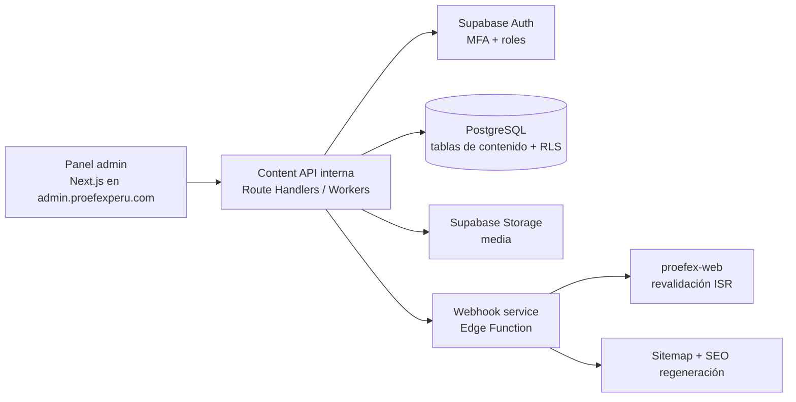

# Documento 06 — Arquitectura CMS

**Fase:** 0 — Definición
**Estado:** Propuesta para revisión (motor del CMS = decisión abierta, Doc 19)

---

## 1. Qué es y qué no es el CMS

**Es:** un sistema de administración de contenido estructurado por bloques tipados, colecciones, flujos editoriales, roles y SEO, sobre Supabase.

**No es:** un page builder libre tipo Elementor. El editor elige bloques predefinidos con propiedades validadas; la presentación vive en el frontend (Documento 05).

### 1.1 Límite de alcance explícito (revisión Agent Master)

"CMS custom" **no significa** construir un CMS empresarial completo desde cero. El alcance inicial se limita a:

páginas · bloques estructurados · media · SEO · blog · categorías · autores · navegación · configuración global · formularios · usuarios · roles · publicación · preview

**Explícitamente fuera del alcance inicial** (evaluar solo como funcionalidad futura, bajo demanda y justificadas):

- Workflow editorial avanzado (aprobaciones multi-nivel complejas)
- DAM empresarial (gestión avanzada de activos digitales)
- Traducción avanzada / localización (D4: solo arquitectura preparada)
- Personalización de contenido por usuario
- Automatización editorial
- Cualquier forma de page builder libre

Este límite se documenta como restricción de producto: si una necesidad futura no cabe en los bloques tipados, se resuelve ampliando el catálogo de bloques, nunca liberando el layout.

## 2. Opciones de motor

| Opción | Pros | Contras | Valoración |
|---|---|---|---|
| **A. CMS custom (Next.js + Supabase)** — recomendada | Control total de bloques y RBAC; stack único TS; sin licencias; RLS nativo | Más desarrollo inicial; mantenimiento propio | ✅ Recomendada si hay capacidad de desarrollo |
| B. Headless self-hosted (Strapi/Payload) | Admin listo, rápida salida | Esquemas de bloques menos ajustados a nuestro modelo; otro backend que operar | Alternativa válida |
| C. SaaS headless (Sanity/Contentful) | Cero operación | Costo recurrente, vendor lock-in, RLS/roles limitados a su modelo | Descartada como primera opción |

**Recomendación: Opción A**, porque el modelo de bloques (Doc 05) es el corazón del producto y los roles RBAC se integran con RLS de Supabase. Se presenta para aprobación (Doc 19).

## 3. Arquitectura del CMS (Opción A)

Componentes:

1. **Panel admin** (`admin.proefexperu.com`): editor de bloques (lista ordenada + formularios por tipo), gestor de media, colecciones, usuarios/roles, redirects, settings, preview.
2. **Paquete compartido** `@proefex/blocks-schema`: definiciones de bloques y validación compartida entre CMS y web. Única dependencia cruzada entre repos (publicada como paquete privado).
3. **Content API:** endpoints de lectura pública (con caché) para el frontend y endpoints de escritura autenticados para el panel.
4. **Preview:** render de borradores en el frontend con token firmado de corta duración.
5. **Publicación:** al publicar → webhook → revalidación ISR por tag + sitemap update.

## 4. Módulos funcionales del panel

| Módulo | Funcionalidad |
|---|---|
| Dashboard | Estado de contenidos, borradores, programados, actividad reciente |
| Páginas | Editor de bloques, universos, SEO, programación |
| Colecciones | Servicios, Productos, SaaS, Sectores, Casos, Posts (CRUD + relaciones) |
| Media | Subida, alt text, focal point, formatos, biblioteca con búsqueda |
| FAQ | Banco global y por entidad |
| Blog | Categorías, tags, autores, programación |
| Usuarios y roles | Invitación, asignación de rol, desactivación |
| SEO | Metadatos por entidad, sitemap status, redirects |
| Settings | Navegación, footer, contacto, scripts (con control de permisos) |
| Auditoría | Log de acciones (solo lectura para ADMIN+) |

## 5. RBAC — Roles y permisos

**Principio:** empezar con el mínimo necesario y ampliar; los roles del brief existen como diseño, no todos se activan en fase 1.

| Rol | Fase 1 | Permisos |
|---|---|---|
| SUPER_ADMIN | ✅ | Todo, incl. gestión de roles, settings y secretos operativos |
| ADMIN | ✅ | Todo el contenido y usuarios (excepto roles/settings críticos) |
| EDITOR | ✅ | Crear/editar/publicar todo tipo de contenido |
| AUTHOR | ✅ | Crear/editar sus propios posts y borradores; no publicar |
| SEO_MANAGER | ✅ | Editar SEO, redirects, sitemap, metadatos; no el contenido base |
| MARKETING | Fase 2 | Landings de campaña, CTA, banners |
| SALES | Fase 2 | Solo lectura de contenido y leads |
| INSTRUCTOR | Fase LMS | Contenido de cursos |
| LMS_ADMIN | Fase LMS | Gestión del LMS |

Implementación: tabla `cms_users` con rol; políticas RLS por tabla y rol; funciones de escritura validan permiso server-side además de RLS (defensa en profundidad).

## 6. API de contenido (lectura pública)

- `GET /v1/content/pages/:slug` — página con bloques
- `GET /v1/content/collections/:type` — listado paginado con filtros
- `GET /v1/content/collections/:type/:slug` — detalle
- `GET /v1/content/navigation` — menús y settings
- Respuestas con ETag + `s-maxage`/`stale-while-revalidate` en Cloudflare.
- Invalidación por webhook firmado al publicar.

## 7. Media en el CMS

Detalle en Documento 13. El CMS gestiona: subida a Storage, generación de formatos (AVIF/WebP), alt text obligatorio, focal point para crops, y validación de peso/formato.

## 8. Versionado y seguridad

- Auto-guardado con historial por contenido (últimas N versiones, restaurable).
- Todos los writes pasan por validación de esquema + permisos server-side.
- Sesiones con expiración, MFA disponible para ADMIN/SUPER_ADMIN.
- `admin.` no indexado y protegido por rate limiting en Cloudflare (Doc 19).
