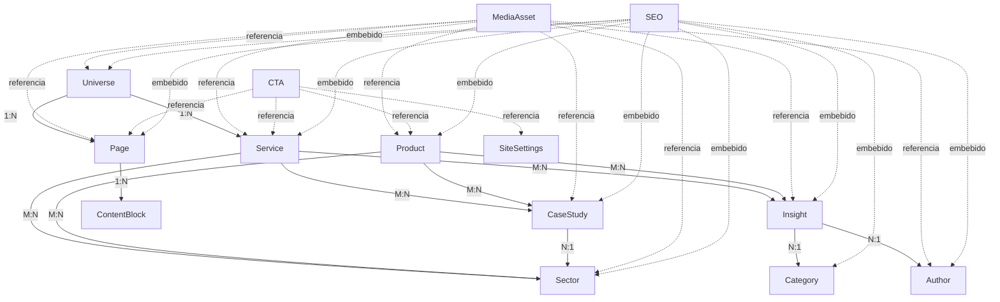

# Fase 3.1 — Content Architecture (Fuente de Verdad)

**Estado:** `PHASE_3_1_CONTENT_ARCHITECTURE_COMPLETE — REQUIRES_PROEFEX_APPROVAL`
**Base:** `8b7afb4` (Fase 2 congelada visualmente · `PHASE_2_4_CONTENT_BLOCKED — REQUIRES_PROEFEX_INPUT`)
**Alcance:** diseño y documentación del modelo de contenido. **No** incluye construcción del CMS UI, API completa, conexión a Turu CRM, migración de contenido ni ningún cambio visual.

Documentos hermanos:

| Documento | Contenido |
|---|---|
| `docs/fase-3/content-architecture.md` (este) | Entidades, campos, relaciones, URLs, bloques, contratos |
| `docs/fase-3/cms-schema.md` | Mapeo Supabase: tablas, enums, FKs, índices, RLS, storage, versionado |
| `docs/fase-3/content-governance.md` | Gobernanza: RBAC, flujo editorial, reglas de contenido, inventario |

---

## 1. Principio fundamental: CONTENT ≠ PRESENTATION

PROEFEX **no** se modela como "páginas con texto libre". Se modela como:

```
CONTENIDO (CMS)  ──referencias──▶  MEDIA (biblioteca)
      │
      ▼
PRESENTACIÓN (frontend): layout, diseño, motion, responsive, componentes
```

- **El CMS controla contenido**: entidades estructuradas, textos, relaciones, estados editoriales, SEO.
- **El frontend controla presentación**: layout, diseño, interacción, motion, responsive, componentes (ya construidos y aprobados en Fase 2).
- El CMS **no es un page builder libre** (D1, mandato F3.1 §2). Un editor elige **bloques tipados validados** (`@proefex/blocks-schema`), nunca HTML arbitrario.
- Los colores/temas estructurales de los universos viven en el frontend (`tokens [data-universe]`, D25/D26/D33/D39/D40). El CMS **referencia** un universo; no permite editar colores arbitrariamente.

Consistencia con decisiones previas: D1 (CMS custom Next.js + Supabase, alcance Doc 06), A3 (`@proefex/blocks-schema` compartido), A4 (SSR/ISR + revalidación por webhook), A5 (flujo CMS → api → revalidación web).

---

## 2. Mapa de entidades



Regla transversal: **ninguna entidad almacena archivos de media inline**; siempre referencia `MediaAsset` por id. **Ningún contenido se duplica entre entidades** (un servicio se escribe una vez; lo demás son referencias).

---

## 3. Entidades

Convención de campos de auditoría en todas las entidades (ver `cms-schema.md` §2): `id`, `created_at`, `updated_at`, `created_by`, `updated_by`. Todas las entidades publicables soportan `status: DRAFT | IN_REVIEW | SCHEDULED | PUBLISHED | ARCHIVED` (§3.15) y campo `seo` (§3.12).

### 3.1 `Universe`

Los cinco pilares, sin sexto pilar (mandato F3.1 §4):

| code | name | shortName | slug frontend | pillar |
|---|---|---|---|---|
| `CREATE` | PROEFEX TECH | TECH | `/tech` | Desarrollo y Digitalización |
| `GROW` | Grow Up | Grow Up | `/grow-up` | Marketing y Growth |
| `LEARN` | PROEFEX LEARNS | Learns | `/learns` | Formación y Certificación |
| `EXPERIENCE` | PROEFEX EQUIP | Equip | `/equip` | Tecnología y equipamiento |
| `SOLVE` | PROEFEX Solutions | Solutions | `/solutions` | Productos y soluciones |

Campos:

| Campo | Tipo | Notas |
|---|---|---|
| id | uuid | |
| code | enum `CREATE/GROW/LEARN/EXPERIENCE/SOLVE` | único |
| name, shortName | text | |
| tagline | text | |
| description | text | |
| pillar | text | descripción del pilar |
| accent | **referencia** a token de diseño (`tech`/`growup`/`learns`/`equip`/`solve`), no color libre | el editor elige el universo visual, no un hex |
| theme | referencia a tema (`core`/`tech`/`growup`/`learns`/`equip`/`solve`/`inherit`) | |
| slug | text único | ej. `tech`, `grow-up` |
| hero | MediaRef | |
| navigationOrder | int | orden en megamenú (D26/D35) |
| status, seo | | |

**Regla dura:** el sistema visual existente (tokens, tema, motion, componentes) es la fuente de color/tema/motion. El CMS guarda *qué* universo es cada contenido, no *cómo se pinta*. Mapeo con el frontend actual (D40): `CREATE→tech`, `GROW→growup`, `LEARN→learns`, `EXPERIENCE→equip`, `SOLVE→solve`, y `core` para lo transversal.

### 3.2 `Sector`

Ocho sectores, sin noveno (mandato §5): Industria, Salud, Retail, Educación, Servicios, Minería, Restaurantes, Banca y Seguros. Entidad independiente; **no se duplica el sector dentro de cada página**.

| Campo | Tipo | Notas |
|---|---|---|
| id | uuid | |
| name | text | |
| slug | text único | ej. `industria` |
| shortDescription | text | |
| description | text | |
| heroMedia | MediaRef | |
| visualRef | referencia a icono del set propio (Doc 14 §8) | no subida de iconos sueltos |
| featured | bool | |
| order | int | |
| status, seo | | |

Relaciones derivadas (m2m en el lado opuesto): `services.sectors`, `products.sectors`, `cases.sector`, `insights.relatedSectors`.

### 3.3 `Service`

`Service → Universe` (N:1). Cubre servicios TECH y Grow Up (sustituye al campo `brand` de Doc 05 §2.2, que solo contemplaba dos líneas).

| Campo | Tipo | Notas |
|---|---|---|
| id | uuid | |
| universeId | fk → Universe | |
| name, slug | text | slug único global |
| shortDescription | text | |
| description | text | |
| heroMedia | MediaRef | |
| gallery | MediaRef[] | |
| capabilities | jsonb[] | lista tipada (título + descripción) |
| sectors | m2m → Sector | |
| relatedServices | m2m → Service | |
| relatedCases | m2m → CaseStudy | |
| relatedInsights | m2m → Insight | |
| cta | CTA (referencia embebida) | |
| featured | bool | |
| order | int | |
| status, seo | | |

**Regla:** no duplicar contenido entre servicios. Textos comunes (metodología, garantías) viven en bloques de página o `SiteSettings`, no copiados servicio a servicio.

### 3.4 `Product`

Seis productos SOLVE (mandato §8): **Turu CRM, PROEFACT, My Bpass, AtendiGo, Eleventto, Klyra**. Unifica `saas_products` y `products` (equipamiento) de Doc 05 en un solo modelo con `productKind`:

| Campo | Tipo | Notas |
|---|---|---|
| id | uuid | |
| productKind | enum `saas` \| `equipment` | Turu CRM/PROEFACT/My Bpass/AtendiGo/Eleventto/Klyra = `saas` |
| name, slug | text | |
| shortDescription, description | text | |
| logo | MediaRef | |
| heroMedia | MediaRef | |
| gallery | MediaRef[] | |
| screenshots | MediaRef[] | |
| video | MediaRef (tipo VIDEO) | |
| features | jsonb[] | **solo funcionalidades confirmadas** |
| useCases | jsonb[] | |
| sectors | m2m → Sector | |
| relatedCases | m2m → CaseStudy | |
| relatedInsights | m2m → Insight | |
| cta | CTA | |
| status, seo | | |

**Regla dura (D15):** NO inventar funcionalidades. Si una funcionalidad no está confirmada por PROEFEX, el campo se marca `CONTENT_REQUIRED` y no se publica. El estado comercial de cada producto sigue la matriz D15 (Doc 19): sin confirmación → "próximamente" o no publicado.

### 3.5 `CaseStudy`

| Campo | Tipo | Notas |
|---|---|---|
| id | uuid | |
| title, slug | text | |
| client | text | nombre interno siempre; público según `clientVisibility` |
| clientVisibility | enum `public` \| `anonymous` | **nunca publicar nombres automáticamente** |
| sector | fk → Sector | |
| universe | fk → Universe | |
| summary | text | |
| challenge, solution, process | text/estructurado | |
| results | jsonb[] | **solo métricas provistas por el cliente** (Doc 05 §2.6) |
| technologies | text[] | |
| heroMedia | MediaRef | |
| gallery | MediaRef[] | |
| videos | MediaRef[] | |
| relatedServices | m2m → Service | |
| relatedProducts | m2m → Product | |
| publishedAt | timestamptz | |
| status, seo | | |

### 3.6 `Insight`

Blog (`/insights/[categoria]/[slug]`, D3).

| Campo | Tipo | Notas |
|---|---|---|
| id | uuid | |
| title, slug | text | |
| excerpt | text | |
| content | bloques estructurados (párrafo, heading, imagen, cita, video, CTA) | no HTML libre |
| category | fk → InsightCategory | **valores controlados, no infinitos** |
| tags | text[] | no indexables individualmente (noindex, Doc 05 §2.8) |
| author | fk → Author | |
| heroMedia | MediaRef | |
| publishedAt / updatedAt | timestamptz | |
| readingTime | int | calculado, no manual |
| relatedUniverse | fk → Universe | |
| relatedServices / relatedProducts / relatedSectors | m2m | |
| status, seo | | |

`InsightCategory`: entidad gobernada con lista semilla propuesta (una por pilar + transversales, coherente con la URL por categoría). **La lista final de categorías es una decisión de PROEFEX** (ver §7, decisiones pendientes).

### 3.7 `Author`

| Campo | Tipo | Notas |
|---|---|---|
| id | uuid | |
| name, slug | text | |
| role | text | |
| bio | text | |
| photo | MediaRef | |
| socialLinks | jsonb[] | |
| status | | |

**Regla:** no inventar autores. Solo autores reales entregados por PROEFEX (requerido para GEO/authorship, §6).

### 3.8 `MediaAsset` (prioritaria — desbloquea F2.4/D45)

Biblioteca central. El contenido **referencia** media; nunca almacena archivos.

| Campo | Tipo | Notas |
|---|---|---|
| id | uuid | |
| type | enum `IMAGE` \| `VIDEO` \| `DOCUMENT` | |
| filename | text | |
| url | text | URL servida (storage/CDN) |
| width / height | int | imágenes |
| mimeType | text | |
| alt | text | **obligatorio para publicar** (a11y) |
| title / caption / credit | text | |
| focalPoint | `{x,y}` 0–1 | ya soportado por `MediaFrame` (D41) |
| mobileAsset | fk → MediaAsset | variante móvil explícita (video) |
| poster | fk → MediaAsset | poster de video |
| duration | int (s) | video |
| fileSize | int | |
| copyrightStatus | enum `OWNED` \| `LICENSED` \| `PENDING_REVIEW` | **no publicar con `PENDING_REVIEW`** |
| uploadedAt / updatedAt | timestamptz | |
| status | | |

Tipos: `IMAGE`, `VIDEO`, `DOCUMENT` (mandato §12). Detalle de variantes y video: §4 y §5. Estrategia completa en Doc 13 (sistema de media) y `fase-2/media-system.md` (D41/D42): los placeholders `VISUAL PROVISIONAL` se reemplazan vía props CMS sin cambios de arquitectura.

### 3.9 `Navigation`

Modelo de administración de navegación. **No es un page builder** (mandato §18): solo administra labels, URLs, visibilidad, orden y featured del menú aprobado en F2 (D26/D35 — megamenú editorial de 5 filas-universo + zona transversal; **no reintroducir el megamenu saturado**).

| Campo | Tipo | Notas |
|---|---|---|
| id | uuid | |
| label | text | |
| href | text | |
| parentId | fk nullable → Navigation | un nivel máximo bajo el universo (modelo D26) |
| universe | fk nullable → Universe | |
| visibility | enum `all` \| `desktop` \| `mobile` | |
| order | int | |
| featured | bool | destacados del megamenú |
| status | | |

Fuente única actual: `nav-data.ts`. La migración a este modelo ocurre en fases posteriores; el modelo lo respeta campo a campo.

### 3.10 `SiteSettings`

Registro único (singleton). Controla (mandato §19): site name, logo (MediaRef), favicon (MediaRef), SEO por defecto (SEO embebido), social links, datos de contacto, legal links, configuración de analítica (GA4 — solo IDs de medición, nunca secretos), CTA por defecto (CTA), footer (columnas/link lists tipadas), global announcement (opcional, con on/off y ventana de vigencia).

**Regla:** no almacenar secretos ni API keys (ver `content-governance.md` §6).

### 3.11 `LeadForm` y `Consent`

`LeadForm` — modelo conceptual de formularios. Campos de negocio **fijos** (D17, mandato §20): Nombre, Apellidos, Empresa, Cargo, Email, Teléfono, Código de país, Servicio (select desde `Service`), Sector (select desde `Sector`), Mensaje. Destino: **Turu CRM** (integración en fase posterior — no se conecta en F3.1).

El CMS puede administrar: título, descripción, composición de campos (del conjunto fijo), texto de consentimiento, mensaje de éxito, CTA. **Las credenciales/API keys nunca están en el CMS público**: viven como secretos del entorno de `proefex-api` (Doc 07 §9).

`Consent` — tipos (mandato §21): `privacy`, `analytics`, `marketing`. GA4 aprobado (D18) pero **no se activa tracking sin consentimiento/configuración definida**. Cada envío de formulario registra versión y timestamp de consentimientos. Detalle: `content-governance.md` §7.

### 3.12 `SEO` (entidad reutilizable)

Embebida (jsonb) en toda entidad indexable:

| Campo | Notas |
|---|---|
| metaTitle | ≤ 60 chars |
| metaDescription | ≤ 160 chars |
| canonicalUrl | override |
| robots | default `index,follow` |
| ogTitle / ogDescription / ogImage | ogImage = MediaRef |
| twitterTitle / twitterDescription / twitterImage | |
| schemaType | ver abajo |

`schemaType` permitidos: `Organization`, `WebSite`, `WebPage`, `Article`, `Service`, `Product`, `FAQPage`, `BreadcrumbList`, `VideoObject`, `LocalBusiness` (solo cuando corresponda y exista información real: dirección, teléfono, horarios verificados).

**Regla dura:** no generar schema JSON-LD automáticamente si faltan datos obligatorios del tipo elegido (Doc 08 §3). Detalle y gates de publicación: `content-governance.md` §5.

### 3.13 `CTA` (entidad reutilizable)

| Campo | Tipo |
|---|---|
| label | text |
| href | text |
| type | enum `internal` \| `external` \| `contact` \| `form` \| `product` \| `download` |
| trackingId | text (evento GA4 conceptual, D18) |
| variant | `primary` \| `secondary` \| `ghost` (compatible con `ctaSchema` F1/F2) |

Se administra como catálogo cuando un CTA se repite (mandato §17: no hardcodear CTAs repetidos); en bloques se referencia por id o se embebe copia con origen catalogado.

### 3.14 `Page`

| Campo | Tipo | Notas |
|---|---|---|
| id | uuid | |
| title | text | |
| slug | text único | |
| universe | fk → Universe (nullable = core) | |
| template | enum (abajo) | |
| blocks | jsonb[] — lista ordenada de bloques tipados | validados con `@proefex/blocks-schema` |
| status, seo | | |

Templates iniciales — exactamente siete (mandato §26):

`CORE` · `UNIVERSE` · `SERVICE` · `PRODUCT` · `SECTOR` · `CASE_STUDY` · `INSIGHT`

No se crean cientos de templates: cada template fija qué bloques son válidos, su orden por defecto y su `schemaType` SEO.

### 3.15 `ContentStatus` (transversal)

`DRAFT → IN_REVIEW → SCHEDULED → PUBLISHED → ARCHIVED`

- Nunca se muestra contenido no publicado en producción (RLS + filtro en API, `cms-schema.md` §6).
- `SCHEDULED` publica automáticamente a la hora de `publishedAt` vía job del CMS; la web recibe el webhook de revalidación correspondiente (A5).
- Nota de compatibilidad: `@proefex/blocks-schema` define hoy 4 estados (sin `ARCHIVED`); extender el enum es un cambio de paquete en fase posterior, no en F3.1.

### 3.16 `Redirect`

| Campo | Tipo |
|---|---|
| source | text (path) |
| destination | text |
| statusCode | `301` \| `302` |
| active | bool |

Se evitan cadenas: al crear un redirect cuyo `source` coincide con el `destination` de otro, se resuelve al destino final. Los slugs editados generan redirect automáticamente (Doc 05 §5).

### 3.17 `AuditLog`

| Campo | Tipo |
|---|---|
| actor | fk → cms_user |
| action | `create` \| `update` \| `delete` \| `publish` \| `unpublish` \| `login` \| `role_change` |
| entity | text |
| entityId | uuid |
| timestamp | timestamptz |
| metadata | jsonb (valor anterior/nuevo resumido) |

Append-only. Detalle: `cms-schema.md` §10.

---

## 4. Image variants

Arquitectura preparada para: `original`, `desktop`, `tablet`, `mobile`, `thumbnail`, `social`.

**Estrategia (mandato §13):** no generar variantes manualmente si la infraestructura permite transformación automática.

1. **Fuente única:** el editor sube `original` (≥1920px de ancho, WebP/AVIF/JPEG, ≤300 kB objetivo — Doc 13 §3).
2. **Transformación automática:** cuando la infraestructura de storage/CDN lo soporte (Supabase Storage transforms / image CDN en fase posterior), las variantes se derivan on-the-fly desde `original` vía query/params; `next/image` ya genera los `srcset` responsive en la web.
3. **Variantes explícitas solo cuando son contenido distinto:** `social` (ogImage 1200×630) y `mobileAsset` de video se suben/registran explícitamente porque cambian composición, no solo tamaño.
4. `MediaAsset` guarda solo `original` + referencias; las variantes derivadas **no** son filas nuevas salvo `social`/`mobileAsset`.

Reglas transversales de performance/a11y se heredan de Doc 13 §5–6 y A6.

---

## 5. Video

El CMS soporta por asset de video (mandato §14):

| Campo | Notas |
|---|---|
| source | archivo o URL del proveedor (D5: proveedor especializado aún `DEFERRED`) |
| poster | MediaRef obligatorio |
| duration | segundos |
| autoplay | **default `false`** — no autoplay en contenido editorial |
| muted | default `true` |
| loop | default `false` |
| controls | default `true` |
| mobileAsset | versión mobile (menor peso/resolución) |
| captions/subtitles | pista VTT por idioma |
| transcript | texto (a11y + GEO) |

Excepción hero: `autoplay=true` permitido **solo** en héroes y si cumple accessibility/performance (silencioso, loop corto, `prefers-reduced-motion` respetado, poster fallback) — exactamente el contrato ya implementado en `MediaHeroVideo` (D41, A7).

---

## 6. SEO / GEO (requisitos estructurales)

GEO no es una sección del CMS: es una propiedad estructural del modelo (mandato §16):

| Requisito GEO | Cómo lo satisface el modelo |
|---|---|
| Entidades y relaciones claras | §2: Universe→Service→CaseStudy→Sector; Product→CaseStudy→Insight |
| Definiciones claras | `shortDescription` + `description` obligatorios y diferenciados |
| FAQs | bloque `FAQ` con schema `FAQPage` en Service/Sector/Product (Doc 05 §2.9) |
| Authorship | `Insight.author → Author` con bio y foto reales |
| Dates | `publishedAt`/`updatedAt` en CaseStudy e Insight |
| Citations/references | campo de fuentes en Insight cuando corresponda (contenido provisto) |
| Structured data | `SEO.schemaType` con gates (§3.12) |
| Topical relationships | m2m related* en Service/Product/CaseStudy/Insight |

El contenido debe ser comprensible igual para usuarios que para motores de búsqueda/generación: titulares descriptivos, entidades nombradas, fechas visibles, autoría identificable. Estrategia completa: Doc 08.

---

## 7. Decisiones pendientes de PROEFEX (heredadas + nuevas)

Este modelo **no inventa contenido**. Quedan abiertas (detalle en `content-governance.md` §8 y `decision-register.md`):

| Decisión | Impacto en el modelo |
|---|---|
| D13 — inventario de contenido | alimenta todas las entidades; Media bloqueada |
| D15 — matriz de productos SaaS | `Product.features` / estado comercial |
| D5 — arquitectura de video / proveedor | `MediaAsset` VIDEO: source interno vs CDN |
| **Nueva** — lista final de `InsightCategory` | la URL `/insights/[categoria]/[slug]` exige categorías definitivas |
| **Nueva** — autores reales para Insight | `Author` no se puebla sin personas reales |
| **Nueva** — textos legales (privacidad/cookies) | `Consent` y `LeadForm` no se publican sin ellos (D17) |
| **Nueva** — datos de contacto/LocalBusiness | `SiteSettings` + schema `LocalBusiness` solo con datos reales |

---

## 8. Contratos derivados

Los siguientes contratos se documentan en detalle en los documentos hermanos:

- **Supabase mapping** (tablas, enums, FKs, índices, RLS, storage): `cms-schema.md`.
- **RBAC** (roles y matriz de permisos) y flujo editorial: `content-governance.md`.
- **API contract** y **cache/revalidation** (CMS → webhook → API → ISR): `cms-schema.md` §8–9 (extienden A4/A5 y el `publishWebhookSchema` existente en `@proefex/blocks-schema`).
- **Multilingual** (es inicial, `en` preparado, sin duplicar tablas): `cms-schema.md` §11.

---

## 9. Definition of Done — mapping

| Ítem DoD (mandato §40) | Cubierto en |
|---|---|
| content architecture documentada | este doc §1–8 |
| CMS schema documentado | `cms-schema.md` |
| cinco universos definidos | §3.1 |
| ocho sectores definidos | §3.2 |
| services / products / case studies / insights / authors model | §3.3–3.7 |
| media library + video model | §3.8, §4, §5 |
| SEO model + GEO requirements | §3.12, §6 |
| CTA / navigation / site settings | §3.13, §3.9, §3.10 |
| forms + consent | §3.11 |
| RBAC | `content-governance.md` §3 |
| page model + blocks | §3.14 + `content-architecture.md` §3.14, catálogo en `cms-schema.md` §7 |
| redirects + versioning | §3.16, `cms-schema.md` §10 |
| API contract + cache/revalidation | `cms-schema.md` §8–9 |
| Supabase mapping + RLS + audit log | `cms-schema.md` §2, §6, §10 |
| multilingual strategy | `cms-schema.md` §11 |
| content inventory actualizado | `content-governance.md` §8 + matriz en `docs/content-inventory.md` |
| no contenido ficticio / no cambios visuales | regla transversal; Fase 2 intacta |
